## Section 6: Supabase Object Store
Supabase is an open-source Firebase alternative that provides developers with a complete backend-as-a-service platform centered around PostgreSQL, a powerful relational database system offering full SQL capabilities, real-time subscriptions, and robust extensions for scalable data management. Its object storage is an S3-compatible service designed for storing and serving files like images, videos, and user-generated content.

Website: https://supabase.com/

**Requirements**:
- Build a document upload and file management system powered by Supabase. The backend will include API endpoints to interact with Supabse.
- **Note:** The detailed requirement will be discussed in week 4 lecture.
- Make regular commits to the repository and push the update to Github.
- Capture and paste the screenshots of your steps during development and how you test the app. Show a screenshot of the documents stored in your Supabase Object Database.

Test the app in your local development environment, then deploy the app to Vercel and ensure all functionality works as expected in the deployed environment.

**Steps with major screenshots:**

> [Important: Capture and paste screenshots of your implementation at each step above, especially showing the files in your Supabase Storage bucket]
### Step 1: Create a Supabase Account and Project

1. Go to [Supabase.com](https://supabase.com) and sign up for a free account using your GitHub account
2. Click **New Project** to create a new project
3. Configure your project:
   - **Name**: `ai-summary-app` (or your preferred name)
   - **Database Password**: Create a strong password (save this somewhere secure)
   - **Region**: Choose the region closest to you (e.g., `Asia Pacific (Singapore)`)
4. Click **Create new project** and wait for it to initialize (this may take a minute or two)

**Understanding Supabase**: Supabase provides three main services we'll use:
- **PostgreSQL Database**: For storing document metadata (we'll use this in Section 8)
- **Object Storage**: For storing actual document files (PDF, DOCX, etc.)
- **Auth** (optional): For user authentication

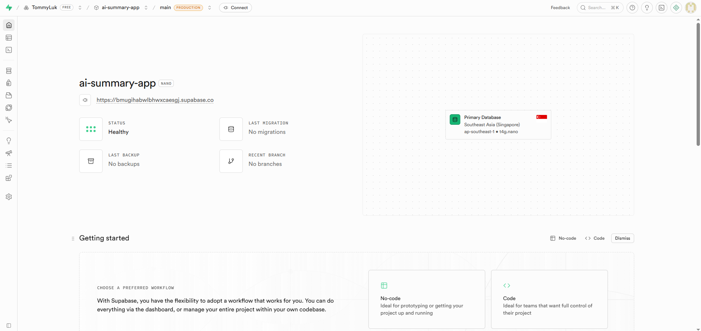

### Step 2: Set Up Supabase Object Storage

Once your project is created, you'll see the dashboard. Now let's create a storage bucket for documents.

1. In the left sidebar, click **Storage**
2. Click **Create a new bucket**
3. Configure the bucket:
   - **Bucket name**: `documents` (lowercase, no spaces)
   - **Make it public**: Leave unchecked for now (we'll control access via API)
4. Click **Create bucket**

**Why buckets?** Buckets are like folders in S3-compatible storage. They organize files by category. We use a "documents" bucket to store user-uploaded files.

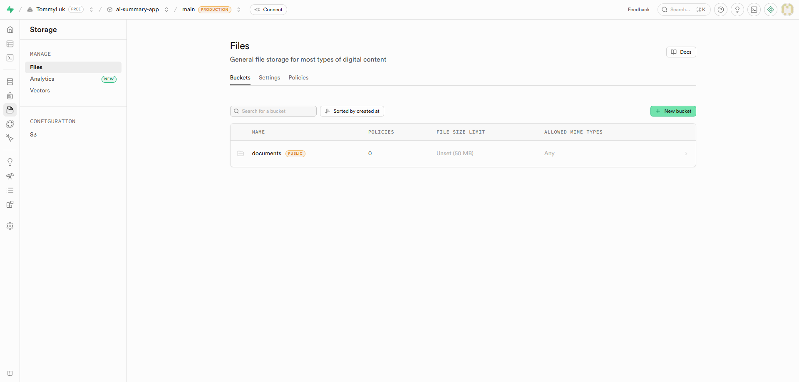

### Step 3: Get Your Supabase API Credentials

#### 3.1: Create the `.env.local` file

First, create a `.env.local` file in your `my-app/` directory:

1. Open VS Code Explorer and navigate to the `my-app/` folder
2. Right-click in the Explorer and select **New File**
3. Name the file `.env.local`
4. The file will be created in the `my-app/` directory

**Why `.env.local`?** This file stores environment variables that:
- Are specific to your local development environment
- Should NOT be committed to GitHub (it's already in `.gitignore`)
- Are automatically loaded by Next.js when running locally

#### 3.2: Add Supabase API Credentials

1. Go back to your Supabase Dashboard
2. Click **Settings** (bottom of left sidebar)
3. Click **API** in the submenu
4. Copy these values:
   - **Project URL**: The URL under "Project URL"
   - **Anon Key**: The key under "anon" (public key)
   - **Service Role Key**: The key under "service_role" (secret key — keep this private!)

5. Paste the values into your `.env.local` file:

```bash
NEXT_PUBLIC_SUPABASE_URL=https://your-project.supabase.co
NEXT_PUBLIC_SUPABASE_ANON_KEY=your_anon_key_here
SUPABASE_SERVICE_ROLE_KEY=your_service_role_key_here
```

**Replace the values with your actual keys from Supabase.**

6. Save the file: **Ctrl+S** (Windows/Linux) or **Cmd+S** (Mac)

**Important**: 
- `NEXT_PUBLIC_` prefix means this is safe to expose in the browser (it's the public anonymous key)
- `SUPABASE_SERVICE_ROLE_KEY` is secret and should ONLY be used on the server side
- Never commit `.env.local` to GitHub (it's in `.gitignore`)
- After creating `.env.local`, you may need to restart your Next.js dev server for changes to take effect

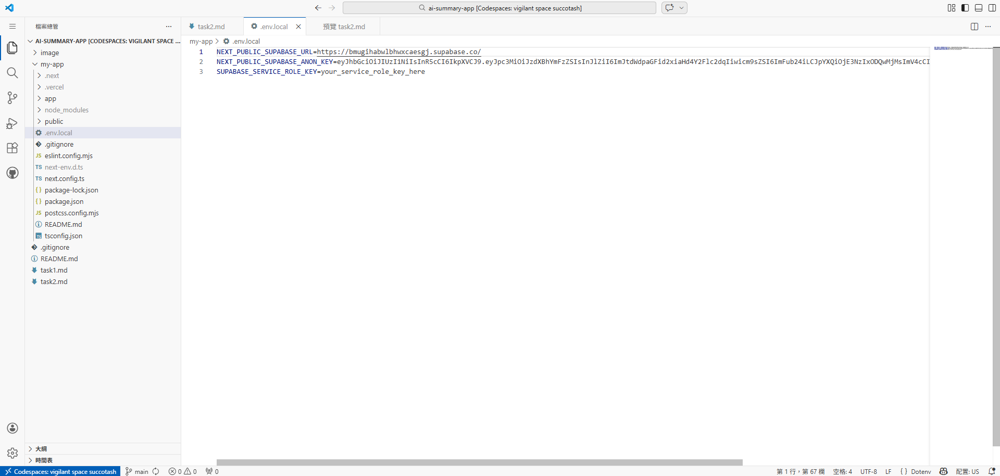

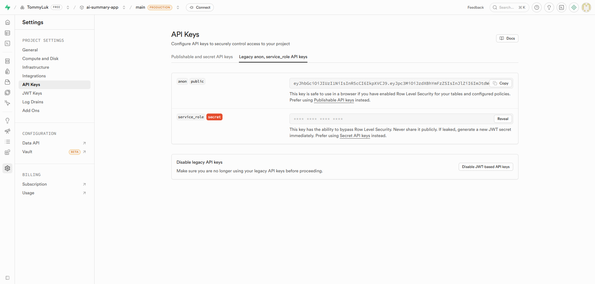

### Step 4: Install Supabase Client Library

In your `my-app/` directory, install the Supabase JavaScript client:

```bash
npm install @supabase/supabase-js
```

This library provides methods to interact with Supabase from your Node.js and browser code.

**Understanding the Client**: The Supabase client is an abstraction layer that:
- Handles authentication with Supabase
- Manages file uploads/downloads to object storage
- Executes database queries
- Manages real-time subscriptions

### Step 5: Create a Supabase Client Configuration File

Create `my-app/app/lib/supabase.ts`:

```typescript
import { createClient } from '@supabase/supabase-js';

const supabaseUrl = process.env.NEXT_PUBLIC_SUPABASE_URL;
const supabaseAnonKey = process.env.NEXT_PUBLIC_SUPABASE_ANON_KEY;

if (!supabaseUrl || !supabaseAnonKey) {
  throw new Error('Missing Supabase environment variables');
}

// Client-side Supabase client (can be used in browser and server)
export const supabase = createClient(supabaseUrl, supabaseAnonKey);
```

**Why separate this?** By creating a dedicated configuration file, we:
- Have a single source of truth for Supabase initialization
- Can easily import it in multiple files
- Keep environment variable validation in one place

### Step 6: Create Backend API Route for File Upload

Create `my-app/app/api/upload/route.ts`:

```typescript
import { createClient } from '@supabase/supabase-js';
import { NextRequest, NextResponse } from 'next/server';

export async function POST(request: NextRequest) {
  try {
    // Initialize Supabase with service role key (server-side only)
    const supabase = createClient(
      process.env.NEXT_PUBLIC_SUPABASE_URL!,
      process.env.SUPABASE_SERVICE_ROLE_KEY!
    );

    // Get the file from the request
    const formData = await request.formData();
    const file = formData.get('file') as File;

    if (!file) {
      return NextResponse.json(
        { error: 'No file provided' },
        { status: 400 }
      );
    }

    // Generate a unique filename
    const filename = `${Date.now()}-${file.name}`;

    // Upload file to Supabase object storage
    const { data, error } = await supabase.storage
      .from('documents')
      .upload(filename, file);

    if (error) {
      return NextResponse.json(
        { error: error.message },
        { status: 400 }
      );
    }

    // Return the file path
    return NextResponse.json({
      message: 'File uploaded successfully',
      path: data.path,
      filename: filename,
    });
  } catch (error) {
    return NextResponse.json(
      { error: error instanceof Error ? error.message : 'Unknown error' },
      { status: 500 }
    );
  }
}
```

**Key Concepts Explained**:
- **Service Role Key**: Used on the server side for operations we want to protect (the browser shouldn't have this key)
- **FormData**: Standard way to send files in HTTP requests
- **Unique Filenames**: Prevents file collisions (two users uploading the same filename)
- **Error Handling**: Always catch errors and return meaningful messages

### Step 7: Create Backend API Route for File Listing

Create `my-app/app/api/documents/list/route.ts`:

```typescript
import { createClient } from '@supabase/supabase-js';
import { NextResponse } from 'next/server';

export async function GET() {
  try {
    const supabase = createClient(
      process.env.NEXT_PUBLIC_SUPABASE_URL!,
      process.env.SUPABASE_SERVICE_ROLE_KEY!
    );

    // List all files in the documents bucket
    const { data, error } = await supabase.storage
      .from('documents')
      .list();

    if (error) {
      return NextResponse.json(
        { error: error.message },
        { status: 400 }
      );
    }

    return NextResponse.json({
      documents: data,
      count: data.length,
    });
  } catch (error) {
    return NextResponse.json(
      { error: error instanceof Error ? error.message : 'Unknown error' },
      { status: 500 }
    );
  }
}
```

**What this does**: Lists all files currently in the `documents` bucket. This is useful for displaying a file list to users.

### Step 7.1: Create API Route for File Deletion

Create `my-app/app/api/documents/delete/route.ts`:

```typescript
import { createClient } from '@supabase/supabase-js';
import { NextRequest, NextResponse } from 'next/server';

export async function DELETE(request: NextRequest) {
  try {
    const supabase = createClient(
      process.env.NEXT_PUBLIC_SUPABASE_URL!,
      process.env.SUPABASE_SERVICE_ROLE_KEY!
    );

    // Get the filename from query parameters
    const searchParams = request.nextUrl.searchParams;
    const filename = searchParams.get('filename');

    if (!filename) {
      return NextResponse.json(
        { error: 'Filename is required' },
        { status: 400 }
      );
    }

    // Delete file from storage
    const { error } = await supabase.storage
      .from('documents')
      .remove([filename]);

    if (error) {
      return NextResponse.json(
        { error: error.message },
        { status: 400 }
      );
    }

    return NextResponse.json({
      message: 'File deleted successfully',
      filename: filename,
    });
  } catch (error) {
    return NextResponse.json(
      { error: error instanceof Error ? error.message : 'Unknown error' },
      { status: 500 }
    );
  }
}
```

**What this does**: Deletes a document from Supabase storage. We pass the filename as a query parameter and return a success message upon deletion.

### Step 7.2: Create API Route for Getting Document Download URL

Create `my-app/app/api/documents/download/route.ts`:

```typescript
import { createClient } from '@supabase/supabase-js';
import { NextRequest, NextResponse } from 'next/server';

export async function GET(request: NextRequest) {
  try {
    const supabase = createClient(
      process.env.NEXT_PUBLIC_SUPABASE_URL!,
      process.env.SUPABASE_SERVICE_ROLE_KEY!
    );

    // Get the filename from query parameters
    const searchParams = request.nextUrl.searchParams;
    const filename = searchParams.get('filename');

    if (!filename) {
      return NextResponse.json(
        { error: 'Filename is required' },
        { status: 400 }
      );
    }

    // Generate a signed URL valid for 1 hour (3600 seconds)
    const { data, error } = await supabase.storage
      .from('documents')
      .createSignedUrl(filename, 3600);

    if (error) {
      return NextResponse.json(
        { error: error.message },
        { status: 400 }
      );
    }

    return NextResponse.json({
      downloadUrl: data.signedUrl,
      filename: filename,
    });
  } catch (error) {
    return NextResponse.json(
      { error: error instanceof Error ? error.message : 'Unknown error' },
      { status: 500 }
    );
  }
}
```

**What this does**: Generates a signed URL that allows temporary access to a document for preview/download. The URL expires after 1 hour for security.

### Step 8: Create a Document List Component

Create `my-app/app/components/DocumentList.tsx`:

```typescript
'use client';

import { useEffect, useState } from 'react';

interface Document {
  name: string;
  created_at: string;
  metadata: {
    size: number;
  };
}

export default function DocumentList({ refreshTrigger }: { refreshTrigger: number }) {
  const [documents, setDocuments] = useState<Document[]>([]);
  const [loading, setLoading] = useState(false);
  const [error, setError] = useState('');
  const [deleting, setDeleting] = useState<string | null>(null);

  const loadDocuments = async () => {
    setLoading(true);
    setError('');
    try {
      const response = await fetch('/api/documents/list');
      const data = await response.json();
      if (!response.ok) {
        setError(data.error || 'Failed to load documents');
      } else {
        setDocuments(data.documents || []);
      }
    } catch (err) {
      setError(err instanceof Error ? err.message : 'Error loading documents');
    } finally {
      setLoading(false);
    }
  };

  useEffect(() => {
    loadDocuments();
  }, [refreshTrigger]);

  const handlePreview = async (filename: string) => {
    try {
      const response = await fetch(`/api/documents/download?filename=${encodeURIComponent(filename)}`);
      const data = await response.json();
      if (!response.ok) {
        setError(data.error || 'Failed to generate preview URL');
      } else {
        // Open in new window for preview
        window.open(data.downloadUrl, '_blank');
      }
    } catch (err) {
      setError(err instanceof Error ? err.message : 'Preview error');
    }
  };

  const handleDelete = async (filename: string) => {
    if (!confirm(`Are you sure you want to delete "${filename}"?`)) {
      return;
    }

    setDeleting(filename);
    try {
      const response = await fetch(`/api/documents/delete?filename=${encodeURIComponent(filename)}`, {
        method: 'DELETE',
      });
      const data = await response.json();
      if (!response.ok) {
        setError(data.error || 'Failed to delete document');
     } else {
        // Remove from list
        setDocuments(documents.filter(doc => doc.name !== filename));
      }
    } catch (err) {
      setError(err instanceof Error ? err.message : 'Delete error');
    } finally {
      setDeleting(null);
    }
  };

  const formatFileSize = (bytes: number) => {
    if (bytes < 1024) return bytes + ' B';
    if (bytes < 1024 * 1024) return (bytes / 1024).toFixed(2) + ' KB';
    return (bytes / (1024 * 1024)).toFixed(2) + ' MB';
  };

  const formatDate = (dateString: string) => {
    const date = new Date(dateString);
    return date.toLocaleDateString() + ' ' + date.toLocaleTimeString();
  };

  return (
    <div className="w-full max-w-4xl mx-auto p-6 border border-gray-300 rounded-lg mt-8">
      <h2 className="text-2xl font-bold mb-4">Uploaded Documents</h2>

      {error && <p className="mb-4 p-4 bg-red-100 text-red-700 rounded">{error}</p>}

      {loading && <p className="text-gray-600">Loading documents...</p>}

      {!loading && documents.length === 0 && (
        <p className="text-gray-600">No documents uploaded yet. Upload one to get started!</p>
      )}

      {!loading && documents.length > 0 && (
        <div className="overflow-x-auto">
          <table className="w-full border-collapse">
            <thead>
              <tr className="bg-gray-200">
                <th className="border p-3 text-left">Filename</th>
                <th className="border p-3 text-left">Size</th>
                <th className="border p-3 text-left">Uploaded</th>
                <th className="border p-3 text-left">Actions</th>
              </tr>
            </thead>
            <tbody>
              {documents.map((doc) => (
                <tr key={doc.name} className="border hover:bg-gray-50">
                  <td className="border p-3">{doc.name}</td>
                  <td className="border p-3">{formatFileSize(doc.metadata?.size || 0)}</td>
                  <td className="border p-3">{formatDate(doc.created_at)}</td>
                  <td className="border p-3">
                    <button
                      onClick={() => handlePreview(doc.name)}
                      className="bg-blue-500 hover:bg-blue-600 text-white py-1 px-3 rounded mr-2"
                    >
                      Preview
                    </button>
                    <button
                      onClick={() => handleDelete(doc.name)}
                      disabled={deleting === doc.name}
                      className="bg-red-500 hover:bg-red-600 disabled:bg-gray-400 text-white py-1 px-3 rounded"
                    >
                      {deleting === doc.name ? 'Deleting...' : 'Delete'}
                    </button>
                  </td>
                </tr>
              ))}
            </tbody>
          </table>
        </div>
      )}
    </div>
  );
}
```

**Component Features**:
- **Load on mount and on refresh**: Uses `refreshTrigger` prop to reload when files are uploaded
- **Preview**: Generates a signed URL and opens the document in a new tab
- **Delete**: Removes the document with confirmation
- **File formatting**: Shows file size in KB/MB and formatted dates
- **User feedback**: Loading states, error messages, and deletion confirmation

### Step 9: Update FileUploader Component

```typescript
'use client';

import { useState } from 'react';

export default function FileUploader() {
  const [file, setFile] = useState<File | null>(null);
  const [uploading, setUploading] = useState(false);
  const [message, setMessage] = useState('');
  const [error, setError] = useState('');

  const handleFileChange = (e: React.ChangeEvent<HTMLInputElement>) => {
    if (e.target.files) {
      setFile(e.target.files[0]);
      setError('');
      setMessage('');
    }
  };

  const handleUpload = async () => {
    if (!file) {
      setError('Please select a file');
      return;
    }

    setUploading(true);
    setError('');
    setMessage('');

    try {
      const formData = new FormData();
      formData.append('file', file);

      const response = await fetch('/api/upload', {
        method: 'POST',
        body: formData,
      });

      const data = await response.json();

      if (!response.ok) {
        setError(data.error || 'Upload failed');
      } else {
        setMessage(`File uploaded successfully: ${data.filename}`);
        setFile(null);
      }
    } catch (err) {
      setError(err instanceof Error ? err.message : 'Upload error');
    } finally {
      setUploading(false);
    }
  };

  return (
    <div className="w-full max-w-md mx-auto p-6 border border-gray-300 rounded-lg">
      <h2 className="text-2xl font-bold mb-4">Upload Document</h2>
      
      <input
        type="file"
        onChange={handleFileChange}
        disabled={uploading}
        className="block w-full mb-4 p-2 border border-gray-200 rounded"
      />

      <button
        onClick={handleUpload}
        disabled={!file || uploading}
        className="w-full bg-blue-500 hover:bg-blue-600 disabled:bg-gray-400 text-white font-bold py-2 px-4 rounded"
      >
        {uploading ? 'Uploading...' : 'Upload'}
      </button>

      {message && <p className="mt-4 text-green-600">{message}</p>}
      {error && <p className="mt-4 text-red-600">{error}</p>}
    </div>
  );
}
```

**Component Breakdown**:
- **State Management**: Tracks the selected file, upload status, and messages
- **File Input**: Allows user to select a file
- **Upload Handler**: Sends file to `/api/upload` endpoint
- **User Feedback**: Shows loading state while uploading, displays success/error messages
- **Disabled State**: Prevents multiple uploads and ensures file is selected

### Step 9.1: Update FileUploader Component to Trigger Refresh

Update `my-app/app/components/FileUploader.tsx`:

```typescript
'use client';

import { useState } from 'react';

interface FileUploaderProps {
  onUploadSuccess: () => void;
}

export default function FileUploader({ onUploadSuccess }: FileUploaderProps) {
  const [file, setFile] = useState<File | null>(null);
  const [uploading, setUploading] = useState(false);
  const [message, setMessage] = useState('');
  const [error, setError] = useState('');

  const handleFileChange = (e: React.ChangeEvent<HTMLInputElement>) => {
    if (e.target.files) {
      setFile(e.target.files[0]);
      setError('');
      setMessage('');
    }
  };

  const handleUpload = async () => {
    if (!file) {
      setError('Please select a file');
      return;
    }

    setUploading(true);
    setError('');
    setMessage('');

    try {
      const formData = new FormData();
      formData.append('file', file);

      const response = await fetch('/api/upload', {
        method: 'POST',
        body: formData,
      });

      const data = await response.json();

      if (!response.ok) {
        setError(data.error || 'Upload failed');
      } else {
        setMessage(`File uploaded successfully: ${data.filename}`);
        setFile(null);
        // Reset file input
        const input = document.querySelector('input[type="file"]') as HTMLInputElement;
        if (input) input.value = '';
        // Trigger refresh of document list
        onUploadSuccess();
      }
    } catch (err) {
      setError(err instanceof Error ? err.message : 'Upload error');
    } finally {
      setUploading(false);
    }
  };

  return (
    <div className="w-full max-w-md mx-auto p-6 border border-gray-300 rounded-lg">
      <h2 className="text-2xl font-bold mb-4">Upload Document</h2>
      
      <input
        type="file"
        onChange={handleFileChange}
        disabled={uploading}
        className="block w-full mb-4 p-2 border border-gray-200 rounded"
      />

      <button
        onClick={handleUpload}
        disabled={!file || uploading}
        className="w-full bg-blue-500 hover:bg-blue-600 disabled:bg-gray-400 text-white font-bold py-2 px-4 rounded"
      >
        {uploading ? 'Uploading...' : 'Upload'}
      </button>

      {message && <p className="mt-4 text-green-600">{message}</p>}
      {error && <p className="mt-4 text-red-600">{error}</p>}
    </div>
  );
}
```

**Key Changes**:
- Added `onUploadSuccess` callback prop to notify parent component when upload is complete
- Resets the file input after successful upload
- Parent component can now trigger document list refresh using this callback

### Step 10: Update Main Page to Show FileUploader and DocumentList

Edit `my-app/app/page.tsx`:

```typescript
'use client';

import { useState } from 'react';
import FileUploader from './components/FileUploader';
import DocumentList from './components/DocumentList';

export default function Home() {
  const [refreshTrigger, setRefreshTrigger] = useState(0);

  const handleUploadSuccess = () => {
    // Increment trigger to refresh document list
    setRefreshTrigger(prev => prev + 1);
  };

  return (
    <main className="min-h-screen bg-gray-100 p-4">
      <div className="max-w-4xl mx-auto">
        <h1 className="text-4xl font-bold text-center mb-8">AI Summary App</h1>
        <FileUploader onUploadSuccess={handleUploadSuccess} />
        <DocumentList refreshTrigger={refreshTrigger} />
      </div>
    </main>
  );
}
```

**What this does**:
- Manages a `refreshTrigger` state
- Passes the `onUploadSuccess` callback to `FileUploader`
- When upload succeeds, increments `refreshTrigger` to refresh the document list
- Displays both the uploader and document list components

1. Start your development server:
   ```bash
   npm run dev
   ```

2. Open http://localhost:3000 in your browser

3. Test the upload:
   - Click the file input and select a test document (PDF, DOCX, TXT, etc.)
   - Click the **Upload** button
   - Verify you see a success message

4. Verify in Supabase Dashboard:
   - Go to [Supabase Dashboard](https://app.supabase.com)
   - Click **Storage** → **documents**
   - You should see your uploaded file there with a timestamp prefix

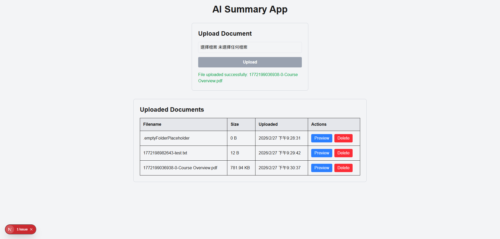

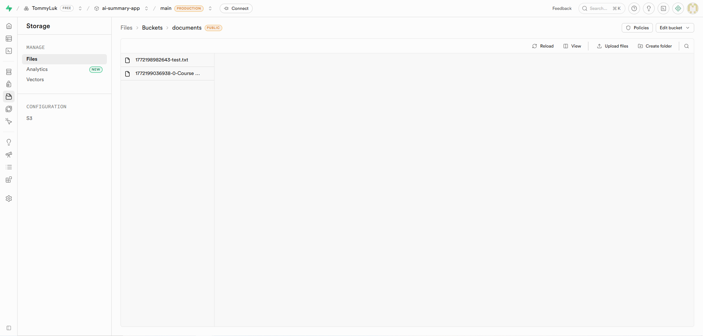

**Testing Best Practices**:
- Test with different file types (PDF, DOCX, TXT) to ensure they all upload
- Test with a moderately sized file to ensure it completes
- Try uploading the same file multiple times and verify they get unique names
- Check the browser console and terminal for any error messages

### Step 11: Deploy to Vercel

**Option A: Deploy using Vercel CLI (Faster)**

1. Install Vercel CLI:
   ```bash
   npm install -g vercel
   ```

2. Commit your changes:
   ```bash
   git add .
   git commit -m "feat: add document list, preview, and delete functionality"
   git push origin main
   ```

3. Add environment variables to Vercel project (run this BEFORE deploying):
   ```bash
   cd my-app
   vercel env add NEXT_PUBLIC_SUPABASE_URL
   ```
   When prompted, paste your Supabase URL from `.env.local`

   Repeat for the other variables:
   ```bash
   vercel env add NEXT_PUBLIC_SUPABASE_ANON_KEY
   vercel env add SUPABASE_SERVICE_ROLE_KEY
   ```

   **What each variable is:**
   - `NEXT_PUBLIC_SUPABASE_URL`: Your Supabase project URL (e.g., `https://your-project.supabase.co`)
   - `NEXT_PUBLIC_SUPABASE_ANON_KEY`: Your anon/public key (safe to expose)
   - `SUPABASE_SERVICE_ROLE_KEY`: Your service role key (keep it secret!)

4. Deploy to production:
   ```bash
   vercel --prod
   ```

5. The CLI will confirm:
   - **Found existing project? Link to it?** - Select "Yes" if linking, or "No" to create a new one
   - The deployment will begin and show you the live URL when complete

6. Once deployed, test your app on the public URL and verify file uploads, previews, and deletions work in production

**Alternative: Set Environment Variables via Web Dashboard**

If the CLI prompts don't work, you can also add them through the web:

1. Go to [Vercel.com](https://vercel.com) and log in
2. Click on your project
3. Go to **Settings** → **Environment Variables**
4. Click **Add New**
5. Enter the variable name and value:
   - Name: `NEXT_PUBLIC_SUPABASE_URL`
   - Value: (paste from your `.env.local`)
6. Select which environment(s): **Production**, **Preview**, **Development**
7. Click **Save**
8. Repeat for the other two variables
9. After adding all variables, redeploy: go to **Deployments** and click **Redeploy** on the latest deployment

**Option B: Deploy using Web Dashboard (More Detailed)**

1. Commit your changes:
   ```bash
   git add .
   git commit -m "feat: add document list, preview, and delete functionality"
   git push origin main
   ```

2. Go to [Vercel.com](https://vercel.com) and log in

3. Click **Add New** → **Project**

4. Import your `ai-summary-app` repository

5. Before deploying, add environment variables:
   - Click **Environment Variables**
   - Add the three variables from your `.env.local`:
     - `NEXT_PUBLIC_SUPABASE_URL`
     - `NEXT_PUBLIC_SUPABASE_ANON_KEY`
     - `SUPABASE_SERVICE_ROLE_KEY`

6. Click **Deploy**

7. Once deployed, test your app on the public URL and verify file uploads, previews, and deletions work in production

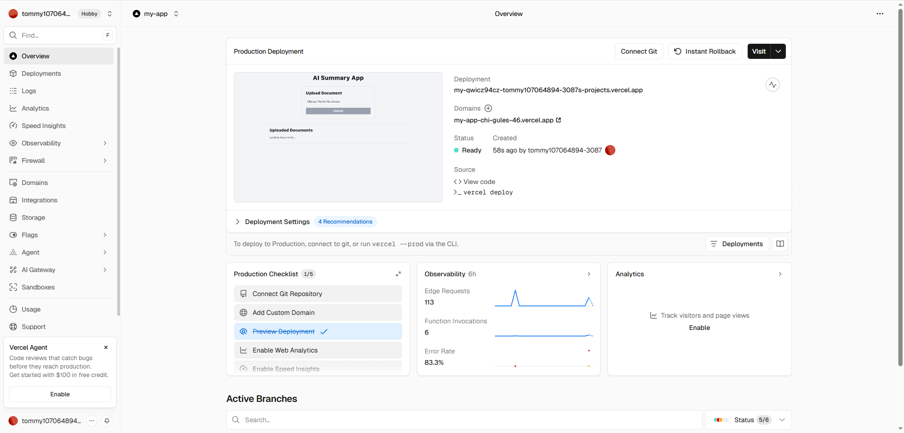

**After Deployment:**
- Your app is now live! Visit the public URL provided by Vercel
- Test uploading, previewing, and deleting documents in production
- For future deployments, just push to `main` and Vercel will automatically redeploy

**Tip:** The CLI approach (Option A) is faster for development and testing, while the dashboard approach (Option B) gives you more control and visibility into your deployment settings.

## Step 12: Final Testing and Validation
- Test all functionalities in the deployed environment:
  - Upload a document and verify it appears in the list
  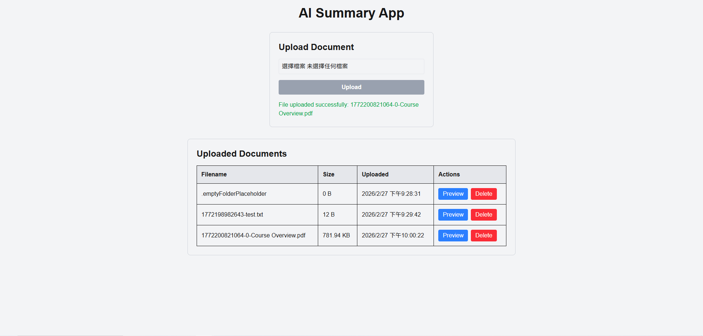

  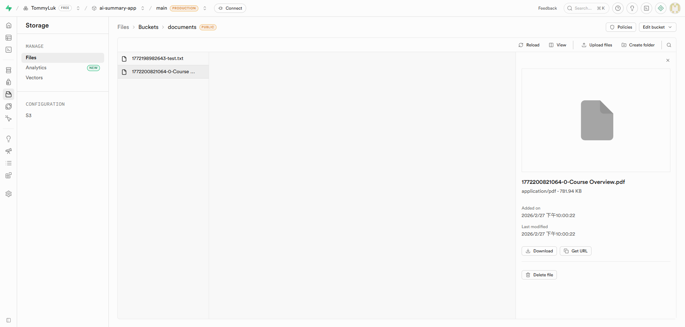

  - Click "Preview" and ensure the document opens correctly
  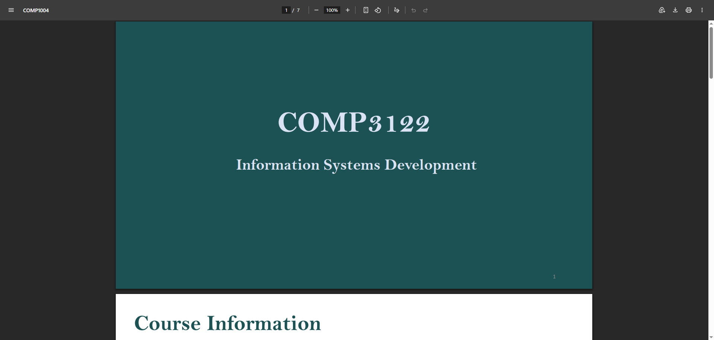
  
  - Click "Delete" and confirm the document is removed from the list and Supabase storage
  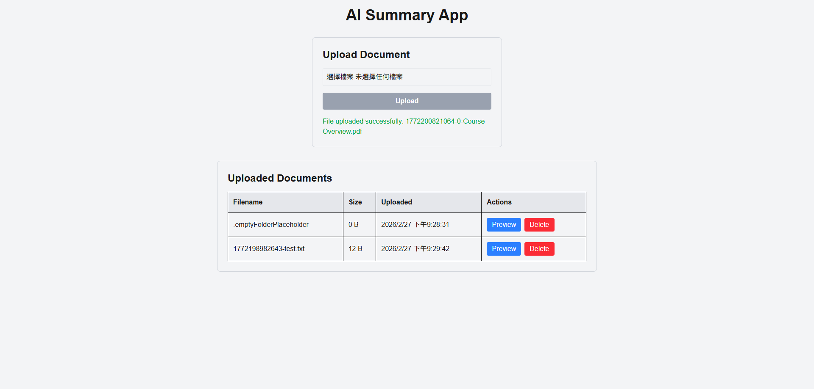

  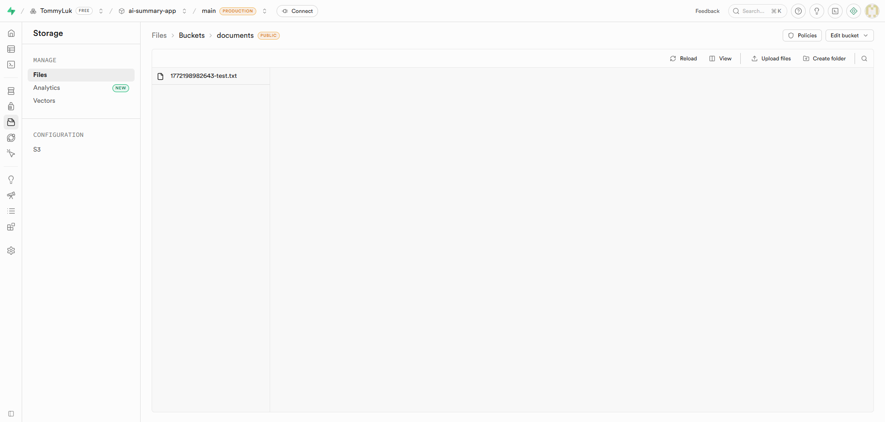
- Verify that the app is responsive and works well on mobile devices
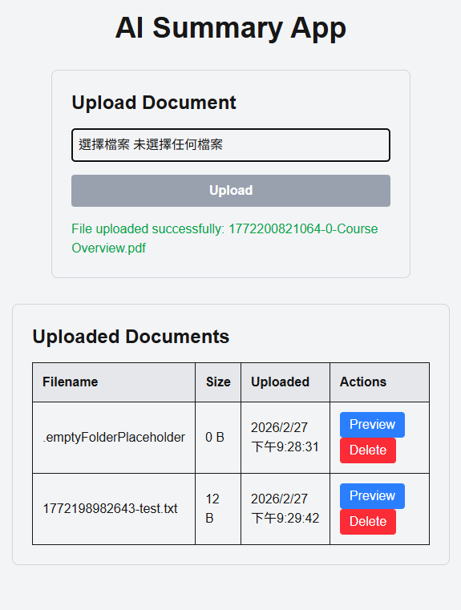

## Section 7: AI Summary for documents
**Requirements:**  
- **Note:** The detailed requirement will be discussed in week 4 lecture.
- Make regular commits to the repository and push the update to Github.
- Capture and paste the screenshots of your steps during development and how you test the app.
- The app should be mobile-friendly and have a responsive design.
- **Important:** You should securely handlle your API keys when pushing your code to GitHub and deploying your app to the production.
- When testing your app, try to explore some tricky and edge test cases that AI may miss. AI can help generate basic test cases, but it's the human expertise to  to think of the edge and tricky test cases that AI cannot be replace. 

Test the app in your local development environment, then deploy the app to Vercel and ensure all functionality works as expected in the deployed environment. 


**Steps with major screenshots:**

> [your steps and screenshots go here]
### Step 1: Install Dependencies for Text Extraction and AI Client

Back in the `my-app/` folder, install any additional libraries you'll need. For PDF extraction we can use `pdf-parse`; for AI calls install `openai` (or another SDK):

```bash
npm install pdf-parse openai
```

If you prefer to extract text using a different tool (Tesseract for images, `mammoth` for DOCX), install those instead.

### Step 7.2: Add Environment Variables for AI Key

Update your `.env.local` with the secret that grants access to your chosen model. For OpenAI:

```bash
OPENAI_API_KEY=your_openai_api_key_here
```

Also add the same variable to `.env.example` (with placeholder value) and set it in Vercel (see Section 6 Step 11 instructions).

### Step 7.3: Create Server–Side Helper to Extract Text and Call AI

Create a new file `my-app/app/lib/ai.ts`:

```typescript
import pdf from 'pdf-parse';
import { Configuration, OpenAIApi } from 'openai';

const openai = new OpenAIApi(new Configuration({
  apiKey: process.env.OPENAI_API_KEY,
}));

export async function extractTextFromPdf(buffer: ArrayBuffer) {
  const data = await pdf(buffer);
  return data.text;
}

export async function summarizeText(text: string) {
  const prompt = `Please write a concise summary (3-4 sentences) of the following document:\n\n${text}`;
  const resp = await openai.createChatCompletion({
    model: 'gpt-4o-mini',
    messages: [{ role: 'system', content: 'You are a helpful summarization assistant.' },
               { role: 'user', content: prompt }],
    max_tokens: 400,
  });
  return resp.data.choices[0].message?.content.trim();
}
```

> 💡 You can adjust the prompt, model, and token limits based on your needs.

### Step 7.4: Add Summary API Route

Create `my-app/app/api/documents/summarize/route.ts`:

```typescript
import { createClient } from '@supabase/supabase-js';
import { NextRequest, NextResponse } from 'next/server';
import { extractTextFromPdf, summarizeText } from '@/app/lib/ai';

export async function POST(request: NextRequest) {
  try {
    const { filename } = await request.json();
    if (!filename) {
      return NextResponse.json({ error: 'Filename required' }, { status: 400 });
    }

    const supabase = createClient(
      process.env.NEXT_PUBLIC_SUPABASE_URL!,
      process.env.SUPABASE_SERVICE_ROLE_KEY!
    );

    // download file from storage
    const { data, error: downloadError } = await supabase.storage
      .from('documents')
      .download(filename);

    if (downloadError || !data) {
      return NextResponse.json({ error: 'Failed to fetch document' }, { status: 500 });
    }

    const arrayBuffer = await data.arrayBuffer();
    const text = await extractTextFromPdf(arrayBuffer);
    const summary = await summarizeText(text);

    // optional: store summary in database
    await supabase.from('summaries').insert({ filename, summary, created_at: new Date() });

    return NextResponse.json({ summary });
  } catch (err) {
    return NextResponse.json({ error: err instanceof Error ? err.message : 'Unknown' }, { status: 500 });
  }
}
```

*Note*: you may need to create a `summaries` table in Supabase. You can skip storing if you prefer.

### Step 7.5: Update DocumentList Component with "Summarize" Button

Modify `DocumentList.tsx` to add a third action:

```tsx
// inside actions <td>...
<button
  onClick={() => handleSummarize(doc.name)}
  className="bg-green-500 hover:bg-green-600 text-white py-1 px-3 rounded mr-2"
>
  Summarize
</button>
```

And add the handler near `handlePreview`:

```tsx
const handleSummarize = async (filename: string) => {
  try {
    const response = await fetch('/api/documents/summarize', {
      method: 'POST',
      headers: { 'Content-Type': 'application/json' },
      body: JSON.stringify({ filename }),
    });
    const data = await response.json();
    if (!response.ok) {
      setError(data.error || 'Summarization failed');
    } else {
      alert(`Summary:\n\n${data.summary}`); // or render in UI
    }
  } catch (err) {
    setError(err instanceof Error ? err.message : 'Error');
  }
};
```

> You may want to render the summary in a modal or below the list instead of an alert.

### Step 7.6: Test Locally

1. Run dev server (`npm run dev`)
2. Upload a document
3. Click **Summarize** on the document row
4. Verify you see a summary pop up or display
5. Check console/logs for any errors
6. Verify the summary is stored in Supabase (via table view)

Capture screenshots of the UI with summary results and the database row.

### Step 7.7: Deploy and Verify

1. Push your changes, then redeploy using the CLI or dashboard (refer to Section 6 Step 11)
2. Make sure `OPENAI_API_KEY` is set in Vercel (via CLI or dashboard)
3. Test the summary flow in the live app
4. Grab screenshots of the deployed version performing summarization

### Step 7.8: Handling Edge Cases & Responsiveness

- Ensure the summary button disables while summarization is in progress
- Catch and display errors if the file is unsupported or the AI service fails
- If text extraction takes long, show a loading spinner or status message
- Test on mobile sizes to make sure table and buttons wrap properly

### Optional Improvements

- Cache summaries per document to avoid repeated API calls
- Allow users to edit or regenerate the summary
- Show a preview of the first few lines of the document before summarizing
- Use a WebSocket or server-sent events for progress updates on very large files

**End of Section 7 tutorial.**

Proceed to Section 8 when you're ready to integrate Postgres for metadata and summary storage.


## Section 8: Database Integration with Supabase  
**Requirements:**  
- Enhance the app to integrate with the Postgres database in Supabase to store the information about the documents and the AI generated summary.
- Make regular commits to the repository and push the update to Github.
- Capture and paste the screenshots of your steps during development and how you test the app.. Show a screenshot of the data stored in your Supabase Postgres Database.

Test the app in your local development environment, then deploy the app to Vercel and ensure all functionality works as expected in the deployed environment.

**Steps with major screenshots:**

> [your steps and screenshots go here]


## Section 9: Additional Features [OPTIONAL]
Implement at least one additional features that you think is useful that can better differentiate your app from others. Describe the feature that you have implemented and provide a screenshot of your app with the new feature.

> [Description of your additional features with screenshot goes here]
